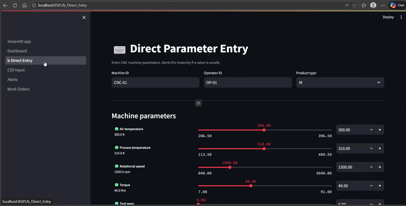

# MachineMind — CNC Predictive Maintenance System

> **Giving the machine a brain.**  
> An AI system that predicts CNC machine failures, catches dangerous operator inputs before they cause damage, and tells you exactly what to do when something goes wrong.

---

## What is MachineMind?

MachineMind is an end-to-end predictive maintenance system built for CNC (Computer Numerical Control) milling machines. It solves three problems that every manufacturing floor faces every day:

1. **Wrong operator inputs** — operators manually type machine settings before every job. One wrong value destroys a $500K machine or scraps a $10K part. No existing system checks the input before the job starts.
2. **Silent machine failures** — tools wear down, sensors drift, temperatures creep up. Machines fail mid-job with zero warning.
3. **Useless alerts** — current systems say something broke but cannot tell you what caused it, which part failed, or what to do next.

MachineMind handles all three — in real time — before the damage is done.

---

## Market Context

| Metric | Value |
|---|---|
| Global CNC market (2024) | $95 Billion |
| Global CNC market (2032) | $195 Billion |
| Annual losses from unplanned downtime | $50 Billion |
| MachineMind's unique position | Only system that prevents failures before they start, without hardware |

---

## How It Works

### Two-Layer Safety System

**Layer 1 — Rule-based validation (instant)**
Before the AI runs, every operator-entered parameter is checked against safe operating ranges. Values outside the range are blocked immediately — no model needed, no latency.

| Parameter | Safe Range |
|---|---|
| Air temperature | 295 – 305 K |
| Process temperature | 305 – 315 K |
| Rotational speed | 1,200 – 2,800 RPM |
| Torque | 10 – 70 Nm |
| Tool wear | 0 – 240 min |

**Layer 2 — 4 AI models running in parallel**
After a reading passes the range check, four machine learning models analyse it simultaneously:

| Model | Type | Task | Performance |
|---|---|---|---|
| BiLSTM | PyTorch deep learning | Failure prediction | AUC: 0.97 |
| Conv1D Autoencoder | PyTorch deep learning | Anomaly detection | AUC: 0.97 |
| Random Forest (200 trees) | scikit-learn | Wrong parameter combinations | AUC: 0.9999 |
| Gradient Boosting Regressor | scikit-learn | Remaining useful life (RUL) | R²: 0.9999, MAE: 0.002 min |

---

## Dataset

**AI4I 2020 Predictive Maintenance Dataset** — UCI Machine Learning Repository (ID: 601)

- 10,000 real CNC machine sensor readings
- 9 features after engineering (5 raw + 4 derived)
- 3.39% overall failure rate
- 5 labeled failure modes: TWF, HDF, PWF, OSF, RNF

**Feature engineering adds 4 derived features:**
- `power_W` = torque × (RPM × 2π / 60)
- `temp_delta_K` = process temp − air temp
- `wear_rate` = tool wear / 240
- `torque_x_rpm` = torque × RPM

**Data split:** 70% train / 15% validation / 15% test — stratified by failure label.

---

## Failure Modes

| Code | Name | Description | Solution |
|---|---|---|---|
| TWF | Tool Wear Failure | Tool wear exceeds safe limit | Replace cutting tool immediately |
| HDF | Heat Dissipation Failure | Coolant or heat exchange failure | Check coolant system, reduce spindle speed |
| PWF | Power Failure | Spindle motor or electrical fault | Check motor, verify voltage, reduce torque load |
| OSF | Overstrain Failure | Mechanical overload | Reduce torque setpoint, decrease feed rate |
| RNF | Random Failure | Unknown or intermittent fault | Run full diagnostic cycle |

---

## Architecture

```
Data (10k rows, 9 features)
        │
        ├── LSTM          → Failure prediction (binary)
        ├── Autoencoder   → Anomaly detection (reconstruction error)
        ├── Random Forest → Wrong parameter detection (binary)
        └── GBR           → RUL regression (minutes)
                │
                ▼ (tracked by MLflow)
           FastAPI backend
                │
           Alert engine (severity: green / yellow / orange / red)
                │
        ┌───────┼────────┐
        ▼       ▼        ▼
   Alert fired  Work order  Solutions
   (type,       (priority,  (step-by-step
   severity,    ETA,        fix actions)
   timestamp)   actions)
        │
        ▼
   Streamlit app ──► Tableau live dashboard
```

---

## Tech Stack

| Layer | Technology |
|---|---|
| Data download | ucimlrepo |
| ML models | PyTorch 2.2, scikit-learn 1.4 |
| Experiment tracking | MLflow 2.10 |
| Backend API | FastAPI 0.109, uvicorn |
| Validation | Pydantic 2.6 |
| Frontend | Streamlit 1.31 |
| Dashboard | Tableau Desktop (Web Data Connector) |
| Charts | Plotly 5.18 |
| HTTP client | httpx 0.26 |
| Containerisation | Docker + docker-compose |
| Logging | loguru |

---

## Project Structure

```
MachineMind/
├── data/
│   ├── preprocess.py          ← Run first — downloads and prepares data
│   └── processed/             ← Auto-generated
│       ├── X_train.npy
│       ├── y_failure_train.npy
│       ├── y_anomaly_train.npy
│       ├── y_wrongparam_train.npy
│       ├── y_rul_train.npy
│       ├── scaler.pkl
│       ├── config.json
│       └── eda_report.json
├── models/
│   ├── train_all.py           ← Run second — trains all 4 models
│   └── saved/                 ← Auto-generated
│       ├── lstm_best.pt
│       ├── autoencoder_best.pt
│       ├── rf_classifier.pkl
│       ├── gbr_rul.pkl
│       ├── ae_threshold.json
│       └── model_meta.json
├── api/
│   └── main.py                ← FastAPI backend
├── app/
│   ├── streamlit_app.py       ← Main Streamlit entry point
│   └── pages/
│       ├── 1_Dashboard.py
│       ├── 2_CSV_Input.py
│       ├── 2b_Direct_Entry.py ← Manual parameter entry with instant alerts
│       ├── 3_Alerts.py
│       └── 4_Work_Orders.py
├── scripts/
│   ├── csv_input.py           ← CLI CSV validator
│   ├── demo_live_feed.py      ← Simulates live machine data
│   └── demo_scripted.py       ← Scripted 4-minute hackathon demo
├── tableau/
│   ├── machinemind_wdc.html   ← Tableau Web Data Connector
│   └── TABLEAU_SETUP.md       ← Step-by-step Tableau guide
├── mlruns/                    ← MLflow experiment tracking (auto-generated)
├── docker-compose.yml
├── requirements.txt
└── README.md
```

---

## Quick Start

### Prerequisites
- Python 3.10+
- Node.js (optional, for Tableau WDC serving)
- Tableau Desktop (for live dashboard)

### Installation

```bash
git clone https://github.com/your-repo/MachineMind
cd MachineMind
pip install -r requirements.txt
```

### Step 1 — Preprocess the data

```bash
python data/preprocess.py
```

Downloads the AI4I 2020 dataset automatically, engineers features, creates train/val/test splits. Takes about 2 minutes.

### Step 2 — Train all 4 models

```bash
python models/train_all.py
```

Trains LSTM, Autoencoder, Random Forest, and GBR sequentially. All results logged to MLflow. Takes about 5–10 minutes on CPU.

### Step 3 — Start the API

```bash
uvicorn api.main:app --port 8000 --reload
```

### Step 4 — Start the Streamlit app

```bash
streamlit run app/streamlit_app.py
```

Open `http://localhost:8501` in your browser.

### Step 5 — Connect Tableau (optional)

```bash
cd tableau
python -m http.server 9000
```

In Tableau Desktop → Connect → Web Data Connector → `http://localhost:9000/machinemind_wdc.html`

### Docker (all-in-one)

```bash
docker-compose up
```

Starts API (port 8000), Streamlit (port 8501), and MLflow UI (port 5000).

---

## API Endpoints

| Method | Endpoint | Description |
|---|---|---|
| POST | `/api/ingest` | Accept sensor reading, run all 4 models, return predictions + alerts |
| POST | `/api/validate_csv` | Validate a single CSV row before submission |
| GET | `/api/alerts` | List active alerts (filterable by severity) |
| GET | `/api/work-orders` | List auto-generated work orders |
| GET | `/api/machines` | Current status of all machines |
| GET | `/api/predictions/history` | Full prediction history (used by Tableau) |
| GET | `/api/health` | Health check — confirms API and models are ready |
| PATCH | `/api/work-orders/{id}/close` | Close a work order |

### Example API call

```bash
curl -X POST http://localhost:8000/api/ingest \
  -H "Content-Type: application/json" \
  -d '{
    "machine_id": "CNC-01",
    "operator_id": "OP-42",
    "product_type": "M",
    "air_temp_K": 300.1,
    "process_temp_K": 310.5,
    "rpm": 1500,
    "torque_Nm": 42.3,
    "tool_wear_min": 88
  }'
```

### Example response

```json
{
  "machine_id": "CNC-01",
  "severity": "warning",
  "scores": {
    "failure_risk": 0.34,
    "anomaly_score": 0.21,
    "wrong_param_prob": 0.08,
    "rul_minutes": 152.0
  },
  "alerts": [
    {
      "type": "failure_prediction",
      "severity": "warning",
      "message": "Failure risk 34% detected on CNC-01",
      "instant_solution": "Inspect cutting tool — replace if wear > 200 min",
      "root_cause": "High tool wear + torque combination"
    }
  ],
  "solutions": [
    "Inspect cutting tool for wear — replace if wear > 200 min",
    "Check coolant flow to cutting zone",
    "Reduce feed rate by 15% to lower mechanical stress"
  ]
}
```

---

## Alert Thresholds

| Signal | Warning | Critical |
|---|---|---|
| Failure risk | > 30% | > 60% |
| Anomaly score | > 0.40 | > 0.70 |
| Wrong param probability | > 0.40 | > 0.65 |
| RUL remaining | < 60 min | < 20 min |

---

## Tableau Dashboard

The live Tableau dashboard connects to the FastAPI via a Web Data Connector and pulls 4 live tables:

| Table | Contents |
|---|---|
| machines | Current status, severity, all scores per machine |
| alerts | All active alerts with type, severity, root cause, instant solution |
| work_orders | Auto-generated work orders with priority, ETA, actions |
| predictions_history | Full time-series of every prediction made |

**5 charts built:**
- Fleet risk bar chart (failure risk per machine, colored by severity)
- RUL countdown (tool life remaining per machine)
- Alerts by type (count of each alert type, colored critical/warning)
- Wrong parameter probability per machine
- RUL trend over time (line chart per machine)

---

## Demo

### Live feed (continuous)

```bash
python scripts/demo_live_feed.py
```

Simulates 6 CNC machines sending sensor readings every 3 seconds. CNC-02 and CNC-05 degrade over time.

### Scripted 4-minute demo

```bash
python scripts/demo_scripted.py
```

Runs a scripted 3-phase demo:
- **Phase 1 (0:00–1:30):** All machines healthy, CNC-02 slowly degrades green → red
- **Phase 2 (1:30–2:30):** Wrong parameter entry on CNC-03, blocked instantly
- **Phase 3 (2:30–4:00):** CNC-05 tool wear races to critical, RUL hits zero

The terminal prints coaching messages telling you exactly when to refresh Tableau and what to say.

---

## Competitive Advantage

| Feature | Fanuc / Haas | Siemens MindSphere | MachineMetrics | MachineMind |
|---|---|---|---|---|
| Failure prediction | No | Partial | Yes | Yes |
| Anomaly detection | No | Yes | Yes | Yes |
| Catches wrong input before job starts | No | No | No | **Yes** |
| RUL estimation | No | No | No | **Yes** |
| Works without IoT hardware | No | No | No | **Yes** |
| Automated work orders + solutions | No | No | No | **Yes** |
| Open / explainable | No | No | No | **Yes** |

> MachineMind is the only system in the market that intercepts dangerous operator input before the machine ever starts — without requiring a single new piece of hardware.

---

## Model Performance

| Model | Metric | Value |
|---|---|---|
| LSTM | Test AUC | 0.9697 |
| Autoencoder | Test AUC | 0.9727 |
| Random Forest | Test AUC | 0.9999 |
| GBR | Test R² | 0.9999 |
| GBR | Test MAE | 0.002 min |

---

## License

MIT License — Copyright © 2026 MachineMind Team

---

## Authors

Mahajan, Khushi; Thomas, Reshma Merin; Thupally, Anvitha -----------
Built at a 48-hour entrepreneurship and innovation hackathon using publicly available manufacturing data from the UCI Machine Learning Repository.
